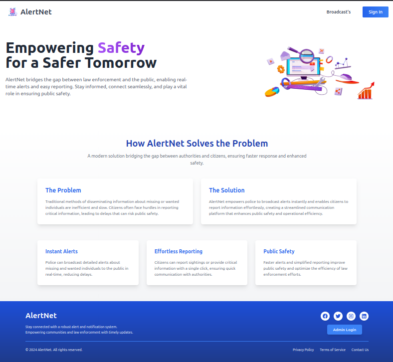

### **AlertNet**

**AlertNet** is a comprehensive web application designed to enhance public safety by enabling real-time communication between citizens, police, and administrators. The platform supports broadcasting alerts for emergencies, reporting suspicious activities, and managing user activities effectively.

### **Table of Contents**

1.  Features
    
2.  Technologies Used
    
3.  System Architecture
    
4.  Installation
    
5.  Usage
    
6.  Contributing
    
7.  Contact
    

### **Features**

#### **Citizen Features**

*   Register and log in securely.
    
*   View live and historical alerts (e.g., missing persons, emergencies).
    
*   Submit reports directly to the police.
    
*   Receive notifications for updates on reports and alerts.
    

#### **Police Features**

*   Broadcast new alerts for missing persons, emergencies, or wanted criminals.
    
*   Update or close existing alerts.
    
*   Analyze citizen reports and manage cases efficiently.
    
*   View reports submitted by citizens.
    

#### **Admin Features**

*   Manage citizen and police user accounts.
    
*   Monitor system activity and ensure compliance.
    

### **Technologies Used**

*   **Frontend**: React.js (Vite), Tailwind CSS
    
*   **Backend**: Spring Boot, Java
    
*   **Authentication**: JWT (JSON Web Tokens)
    
*   **Database**: PostgreSQL
    
*   **Version Control**: Git
    

### **System Architecture**

AlertNet follows a modular architecture with the following components:

1.  **Frontend**: Responsible for user interface and interactions.
    
2.  **Backend**: Handles business logic, authentication, and API endpoints.
    
3.  **Database**: Stores user data, reports, alerts, queries and notifications.
    

#### **Key Modules**

1.  **User Management**
    
    *   Citizen, Police, and Admin roles.
        
    *   Authentication with JWT.
        
2.  **Alert Management**
    
    *   CRUD operations for alerts.
        
3.  **Report Management**
    
    *   Submission, viewing, and status updates for reports.
        
4.  **Notification System**
    
    *   Real-time notifications for citizens and police.
        
3.  **Query Management**
    
    *   Submission, viewing, and status updates for queries submitted by users.
        

### **Installation**

#### **Prerequisites**

*   Node.js
    
*   Java (JDK 17 or higher)
    
*   PostgreSQL
    
*   Maven
    
*   Git
    

#### **Steps**

1.  git clone https://github.com/CS-Kiran/AlertNet.git
2.  cd alertnet
    
3.  **Set up the backend**:
    
    *   cd backend
        
    *   Configure your database in application.properties.
        
    *   mvn clean install
        
    *   mvn spring-boot:run
        
4.  **Set up the frontend**:
    
    *   cd ../frontend
        
    *   npm install
        
    *   npm start
        
5.  **Access the application**:
    
    *   Open [http://localhost:5173](http://localhost:5173) in your browser.
        

### **Usage**

1.  Navigate to the home page and register as a citizen or police user.
    
2.  Log in using your credentials to access the respective dashboard.
    
3.  Citizens can view alerts and submit reports.
    
4.  Police can broadcast, update, or close alerts and analyze reports.
    
5.  Admin can manage users, oversee alerts, and monitor system activity.
    

### **Contributing**

We welcome contributions! To get started:

1.  **Fork the repository**.
    
2.  git checkout -b feature-name
    
3.  git commit -m "Add your message here"
    
4.  git push origin feature-name
    
5.  **Submit a pull request**.
    

Please ensure your code adheres to our coding guidelines and includes relevant tests.
